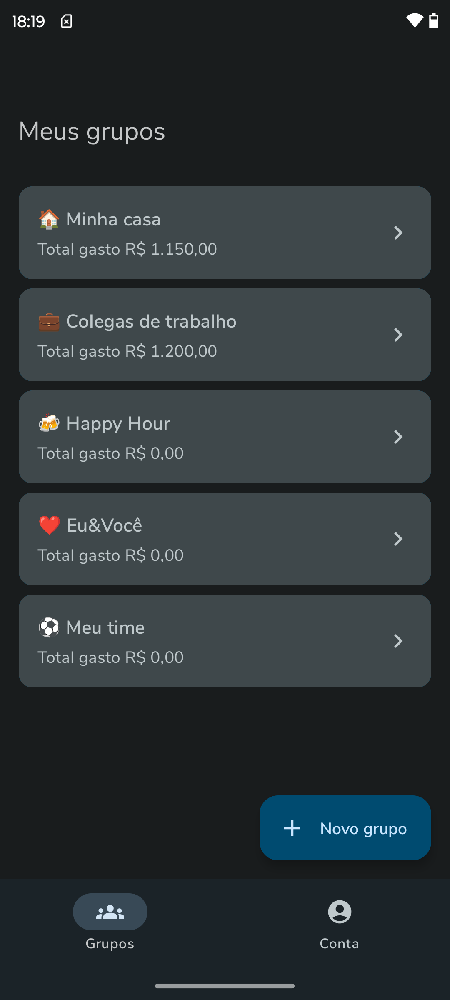
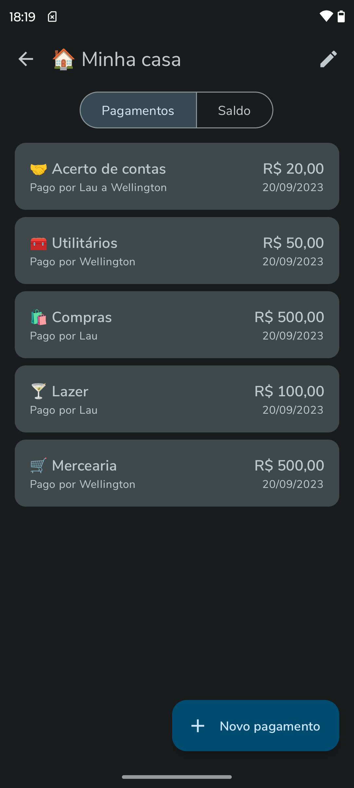
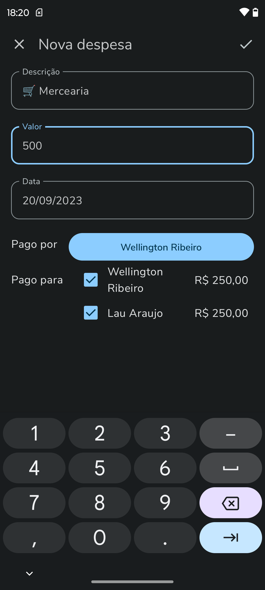
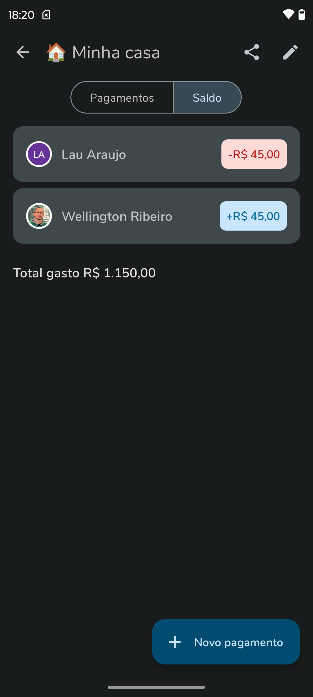

# Shared Bills

Shared Bills is a mobile application designed to help users organize group expenses, split bills, and make settlements effortlessly with friends, family, or roommates.

## Screenshots 📱
<p float="left">
  
  
  
  
</p>

## Features ✨
- **Group Expense Management:** Create and manage groups for different occasions.
- **Smart Bill Splitting:** Split bills equally, by percentage, or with custom amounts.
- **Effortless Settlements:** Quickly settle debts and outstanding balances among group members.
- **Expense History and Analytics:** Gain insights into your spending patterns.

## Usage 📒
1. Login with Google: Users log in using their Google credentials.
2. Create or Join a Group: Start by creating a new expense group or joining an existing one.
3. Add Expenses: Add and categorize expenses within the group.
4. Split Bills: Use various methods to split bills among group members.
5. Settle Balances: Settle outstanding balances and track payments.

## Built with 🛠️
- [Kotlin](https://kotlinlang.org/) - First-class and official programming language for Android development.
- Kotlin coroutines - Library for writing asynchronous code sequentially and concurrently.
- [Jetpack Compose](https://developer.android.com/jetpack/compose) - Android’s modern toolkit for building native UI.
- [Android Architecture Components](https://developer.android.com/topic/libraries/architecture) - Collection of libraries that help you design robust, testable, and maintainable apps.
- [Jetpack Compose Navigation](https://developer.android.com/jetpack/compose/navigation) - Navigation system for allowing users to navigate across different parts of your app.
- [Material 3](https://developer.android.com/reference/kotlin/androidx/compose/material3/package-summary.html) - Modular and customizable Material Design UI components for Android.
- [Firebase Auth](https://firebase.google.com/products/auth) - User authentication with Firebase Authentication.
- [Firebase Firestore](https://firebase.google.com/products/firestore) - Real-time NoSQL database for storing and syncing data.
- [Firebase Cloud Functions](https://firebase.google.com/products/functions) - Serverless backend code execution in response to Firebase events and HTTP requests.
- [Firebase Crashlytics](https://firebase.google.com/products/crashlytics) - Real-time crash reports and app stability analysis.
- [Github Actions](https://github.com/features/actions) - Automation for workflows to build, test, and deploy GitHub projects.


## Contributing 🤝
We welcome contributions! Follow these steps to contribute:

### Getting started 🏁
1. Fork the repository.
2. Create a new branch (`git checkout -b feature/your-feature`).
3. Commit your changes (`git commit -m 'Add some feature'`).
4. Push to the branch (`git push origin feature/your-feature`).
5. Open a Pull Request.

### Installation ⚙️
1. Clone the repository:
   ```sh
   git clone https://github.com/wellingtonrib/SharedBill.git
2. Create your own Firebase project, download the google-services.json at the /app folder.
3. Create the local.properties file in the root of the project and set your FIREBASE_WEB_CLIENT_ID.
4. Deploy the Cloud Functions from the /firebase folder to your Firebase console.
5. Open the project in Android Studio.
6. Sync the project with Gradle files.
7. Build and run the project on an Android device or emulator.

### Project TODOS ✅
https://github.com/users/wellingtonrib/projects/1

## Contact 📫
Developed by Wellington Ribeiro. If you have any questions or feedback, feel free to reach out at [wellington.rib@gmail.com](mailto:wellington.rib@gmail.com).

## Acknowledgements 🫡
Thanks to the open-source community for various libraries and tools used in this project.

## Support 🎗️
If you like this project, please give it a ⭐️! Contributions and suggestions are welcome.

## License 🔑
This project is licensed under the Creative Commons Attribution-NonCommercial 4.0 International Public License. You may share and adapt the material as long as you give appropriate credit, provide a link to the license, and indicate if changes were made. You may not use the material for commercial purposes.
For more details, please refer to the [LICENSE](LICENSE) file.

## Download 📲
Get the Shared Bills app on Google Play!


[Download Shared Bills on Google Play](https://play.google.com/store/apps/details?id=br.com.jwar.sharedbill&hl=pt_BR)
